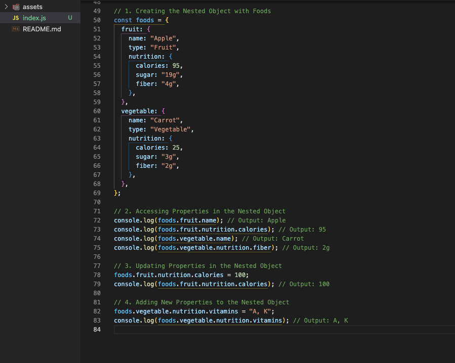

# JavaScript: Working with Nested Objects


## Description 📄
In this assignment, you will practice working with nested objects in JavaScript. This is an essential concept when managing complex data structures, such as storing detailed information about pets or food items. You will learn how to create nested objects, access deeply nested properties, update values, and add new properties to an existing nested object.

You will start by creating an object that represents different pets and their details, such as the pet's name, breed, age, and owner information. After creating the object, you will access various properties within it, modify some of them (e.g., updating the pet's age), and add new properties (such as an owner's phone number). Next, you'll repeat the same steps using a nested object for foods, which stores information about their nutrition.

By the end of this assignment, you will be able to:
- Access properties in deeply nested objects.
- Modify values inside nested objects.
- Dynamically add new properties to existing objects.

---

## Expected Project Structure 🏗️

Your project should be structured as follows:

```plaintext
nested-objects-practice/
   app.js
```

## 

# Instructions ✅

## 1. **Create the Project Folder and Files**
   - [ ] Create a project folder named nested-objects-practice to store your project files.
   
   - [ ] Inside the nested-objects-practice folder, create a file named index.js. This will be your main JavaScript file where all your code will be written
   
 
## 2. **Create the Nested Object for Pets**
In this step, you will create an object that represents pets. The object will include detailed information about each pet's name, breed, and age. Additionally, each pet will have a nested object that represents the owner's details, such as the owner's name, address, and other properties.

A nested object is simply an object within another object. In this case, the pet's owner details will be stored as a nested object inside the main pet object, helping organize complex data in a structured way.

  - [ ] Add the following code to your index.js file:

```javascript
// Creating the Nested Object with Pets
const pets = {
  dog: {
    name: "Buddy",
    breed: "Golden Retriever",
    age: 5,
    owner: {
      name: "John",
      address: {
        street: "123 Pet St",
        city: "Petville",
        postalCode: "12345",
      },
    },
  },
  cat: {
    name: "Whiskers",
    breed: "Siamese",
    age: 3,
    owner: {
      name: "Sarah",
      address: {
        street: "456 Cat Rd",
        city: "Meowtown",
        postalCode: "54321",
      },
    },
  },
};

```

**Explanation:**

  - **Created a Nested Object**: You built a `pets` object containing two nested objects: `dog` and `cat`.
  - **Defined Properties**: Each pet has properties like `name`, `breed`, `age`, and an `owner`.
  - **Nested Owner Object**: The `owner` itself is an object with details like `name` and `address`.
  - **Structured Data**: This step demonstrates organizing data in a hierarchical, nested format for clarity.

### 3. **Access Properties in the Nested Object**

In this step, you will access specific properties from the `pets` object, such as the pet's name, owner's name, and their address. This demonstrates how to navigate through a nested object structure using dot notation to retrieve both top-level properties (like the pet’s name) and deeply nested properties (like the owner's address). By using dot notation, you can move from one level of the object to another, accessing data within multiple layers. This is essential when dealing with complex objects that store a lot of related information.


- [ ] Add the following code to your `index.js` file:

```javascript
// Accessing Properties in the Nested Object
console.log(pets.dog.name); // Output: Buddy
console.log(pets.dog.owner.name); // Output: John
console.log(pets.dog.owner.address.city); // Output: Petville

console.log(pets.cat.name); // Output: Whiskers
console.log(pets.cat.owner.address.street); // Output: 456 Cat Rd
```

- [ ] Run your code using Node.js in the terminal:

```bash
node index.js
```

### Expected Output:

```bash
Buddy
John
Petville
Whiskers
456 Cat Rd

```

### Explanation:

- **Accessing Basic Properties**: You access the `name` property of the `dog` and `cat` objects using `pets.dog.name` and `pets.cat.name`.
- **Accessing Nested Owner Properties**: You retrieve the `name` of each pet's `owner` using dot notation, like `pets.dog.owner.name`.
- **Accessing Address Properties**: You further access the `address` of each owner by chaining the dot notation, such as `pets.dog.owner.address.city` and `pets.cat.owner.address.street`.
- **Dot Notation**: This demonstrates how dot notation allows you to dig into multiple levels of nested objects to retrieve specific values.

### 4. **Update Properties in the Nested Object**

In this step, you will update specific properties within the `pets` object. For example, you will modify the age of the dog by directly assigning a new value to the existing `age` property. This shows how you can easily change values inside a nested object. Additionally, you'll add a completely new property, such as a phone number for the cat's owner, by creating a new key-value pair within the existing structure. This demonstrates how flexible objects are


- [ ] Add the following code to your `index.js` file:

```javascript
// Updating Properties in the Nested Object
pets.dog.age = 6; // Update the dog's age
console.log(pets.dog.age); // Output: 6
```

- [ ] Now, add the following code to your `index.js` file:

```javascript
// Adding New Properties to the Nested Object
pets.cat.owner.phone = "555-1234"; // Add a phone number for the cat's owner
console.log(pets.cat.owner.phone); // Output: 555-1234
```

- [ ] Run your code using Node.js in the terminal:

```bash
node index.js
```

### Expected Output:

```bash
6
555-1234

```

### Explanation:

- **Updating Existing Properties**: You update the `dog`'s `age` by directly assigning a new value (`pets.dog.age = 6`), demonstrating how easy it is to modify values within nested objects.
- **Adding New Properties**: You dynamically add a new `phone` property to the `cat`'s `owner` object. This shows how new properties can be inserted into an object, expanding its structure without redefining it.
- **Dot Notation for Updates**: Dot notation is used both to update existing properties and to add new ones, showing its flexibility in navigating and modifying nested object structures.
- **Dynamic Object Expansion**: By adding a new property (`phone`), you demonstrate how JavaScript objects can be expanded at any time, making them highly adaptable for managing evolving data structures.

### 5. **Create the Nested Object for Foods**

In this step, you will now create a new object named `foods` that organizes information about different types of food items (such as fruits and vegetables) along with their nutritional information. This will show how to handle nested objects for a different kind of data set, reinforcing the concept of organizing complex information using JavaScript objects.

- [ ] Add the following code to your `index.js` file:

```javascript
// Creating the Nested Object with Foods
const foods = {
  fruit: {
    name: "Apple",
    type: "Fruit",
    nutrition: {
      calories: 95,
      sugar: "19g",
      fiber: "4g",
    },
  },
  vegetable: {
    name: "Carrot",
    type: "Vegetable",
    nutrition: {
      calories: 25,
      sugar: "3g",
      fiber: "2g",
    },
  },
};
```
### Explanation

- **Created a New Nested Object**: You built a `foods` object, which contains two categories: `fruit` and `vegetable`.
- **Defined Properties for Each Category**: Each category (fruit and vegetable) has properties such as `name`, `type`, and a nested `nutrition` object.
- **Nested Nutrition Object**: The `nutrition` object for each category contains key information like `calories`, `sugar`, and `fiber`, demonstrating how related data can be grouped together.
- **Organized Data Structure**: This step showcases how to organize data in a hierarchical, easy-to-access format, using nested objects to represent complex relationships between food items and their nutritional content.
- **Structured and Flexible**: The `foods` object structure is flexible, allowing for easy expansion and modification while keeping related data logically grouped together.

### 6. **Access Properties in the Nested Object for Foods**

In this step, you will access specific properties from the `foods` object, such as the food name and nutritional information. This reinforces how to retrieve values from different levels of a nested object structure using dot notation. You will be accessing both top-level and deeply nested properties within the `foods` object.

- [ ] Add the following code to your `index.js` file:

```javascript
// Accessing Properties in the Nested Object
console.log(foods.fruit.name); // Output: Apple
console.log(foods.fruit.nutrition.calories); // Output: 95
console.log(foods.vegetable.name); // Output: Carrot
console.log(foods.vegetable.nutrition.fiber); // Output: 2g
```

- [ ] Run your code using Node.js in the terminal:

```bash
node index.js
```

### Expected Output:

```bash
Apple
95
Carrot
2g

```

### Explanation

- **Accessing Top-Level Properties**: You retrieved the `name` of both the `fruit` and `vegetable` objects by using dot notation (e.g., `foods.fruit.name`).
- **Accessing Nested Properties**: You accessed nested values like `calories` and `fiber` from the `nutrition` objects of both `fruit` and `vegetable` by further extending the dot notation (e.g., `foods.fruit.nutrition.calories`).
- **Dot Notation**: This step demonstrates how dot notation can be used to access properties at different levels within a nested object structure.
- **Structured Data Access**: By accessing both high-level and deeply nested values, you practiced navigating a complex, hierarchical data structure to extract specific information.

### 7. **Update Properties in the Nested Object for Foods**

In this step, you will update an existing property within the `foods` object. Specifically, you will change the `calories` value for the `fruit` object. This step demonstrates how to modify a deeply nested property within a JavaScript object using dot notation. By updating the `calories` value, you will practice how easily properties can be changed in a nested data structure.

- [ ] Add the following code to your `index.js` file:

```javascript
// Updating Properties in the Nested Object
foods.fruit.nutrition.calories = 100; // Update the calories value
console.log(foods.fruit.nutrition.calories); // Output: 100
```

- [ ] Run your code using Node.js in the terminal:

```bash
node index.js
```

### Expected Output:

```bash
**Expected Output:**
```bash
100

```

### Explanation

- **Updating a Nested Property**: You modified the `calories` value within the `nutrition` object of `fruit`, showing how to update a specific property inside a nested structure.
- **Dot Notation for Modifications**: Dot notation was used to access and update the deeply nested property `foods.fruit.nutrition.calories`, demonstrating how to navigate through multiple levels of an object.
- **Verifying the Update**: By logging the updated value (`console.log(foods.fruit.nutrition.calories)`), you confirmed that the `calories` value was successfully changed from `95` to `100`.
- **Modifying Data Dynamically**: This step illustrates how you can easily modify values inside a nested object, reinforcing JavaScript's flexibility in managing dynamic data structures.

### 8. **Add New Properties to the Nested Object for Foods**

In this step, you will add a new property to an existing nested object. Specifically, you will add a `vitamins` property to the `nutrition` object of the `vegetable` category. This demonstrates how you can dynamically expand a JavaScript object to include additional information at any level of nesting.

- [ ] Add the following code to your `index.js` file:

```javascript
// Adding a new property to the Nested Object
foods.vegetable.nutrition.vitamins = "A, K"; // Add vitamins to the vegetable's nutrition object
console.log(foods.vegetable.nutrition.vitamins); // Output: A, K
```

- [ ] Run your code using Node.js in the terminal:

```bash
node index.js
```

### Expected Output:

```bash
A, K
```

### Explanation

- **Adding a New Nested Property**: You added a new `vitamins` property to the `nutrition` object of `vegetable`, showing how to expand an object by introducing new key-value pairs at any level of nesting.
- **Dot Notation for Adding Properties**: Dot notation was used to add the `vitamins` property within the nested structure (`foods.vegetable.nutrition.vitamins`), demonstrating how to extend an object dynamically.
- **Verifying the Addition**: The new `vitamins` property is logged using `console.log`, confirming that it was successfully added and holds the value `"A, K"`.
- **Dynamic Object Expansion**: This step illustrates the flexibility of JavaScript objects, allowing you to easily expand them with new properties without altering the overall structure.

## Conclusion 📄

In this assignment, you gained hands-on experience working with nested objects in JavaScript, a fundamental concept for handling and organizing complex data structures. By accessing, modifying, and adding properties within nested objects, you developed a deeper understanding of how JavaScript objects can represent and manage hierarchical relationships between data.

**Key Takeaways:**
- **Accessing Nested Properties**: You practiced navigating through various levels of a nested object using dot notation. This allows you to retrieve specific values from deeply nested structures, an essential skill when working with complex datasets.
  
- **Modifying Existing Values**: You learned how to update existing properties within a nested object. This demonstrated how simple it is to modify values within an object hierarchy, providing you with the ability to dynamically adjust data.

- **Adding New Properties**: You explored how to dynamically expand objects by adding new key-value pairs at any depth. This flexibility is crucial for scaling your applications and adapting data structures as requirements change.

- **Organizing and Structuring Data**: This assignment emphasized the importance of organizing related data in a clear, logical, and hierarchical format. Nested objects allow for more structured, readable, and maintainable code when handling complex sets of information.

By mastering these techniques, you'll be well-prepared to manage and manipulate intricate data structures in real-world JavaScript applications, enabling you to build more dynamic and scalable projects.

##

### Solution codebase 👀
🛑 **Only use this as a reference** 🛑

💾 **Not something to copy and paste** 💾

**Note:**  This lab references a solution file located [here](https://github.com/HackerUSA-CE/aisd-jse-08-nested-objects/tree/solution) (link not shown).


---
© All rights reserved to ThriveDX